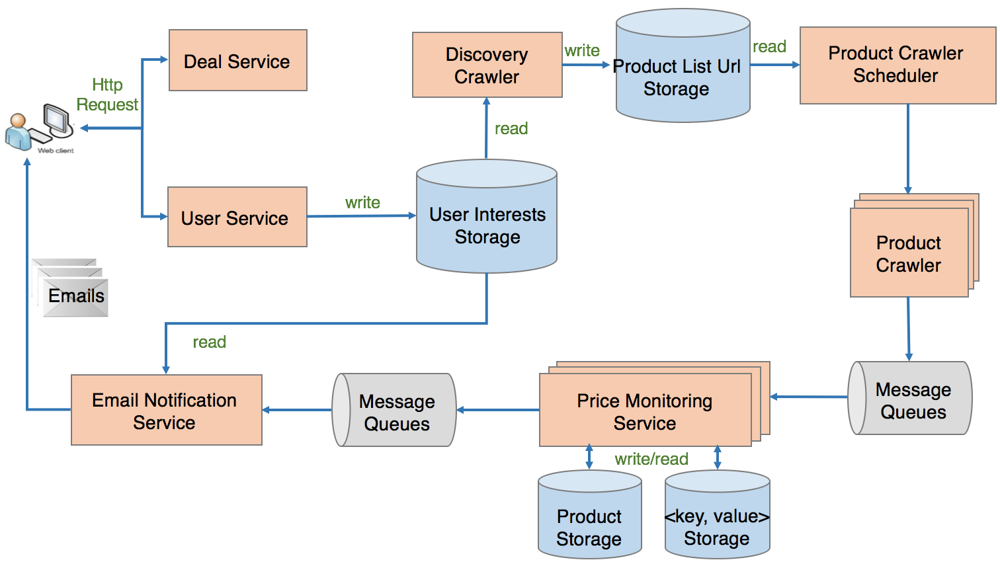
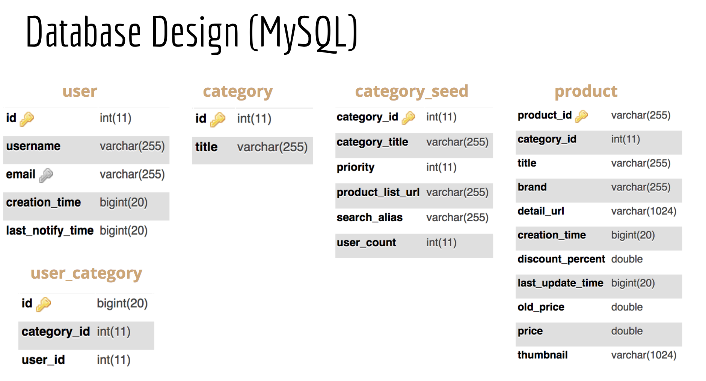
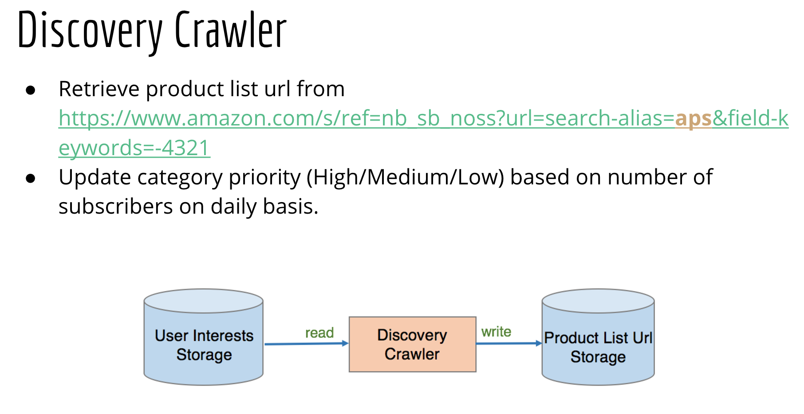
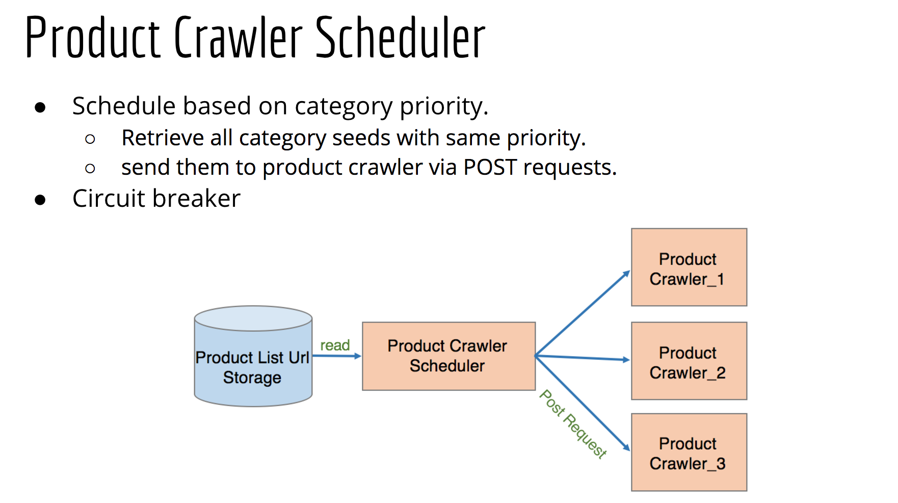
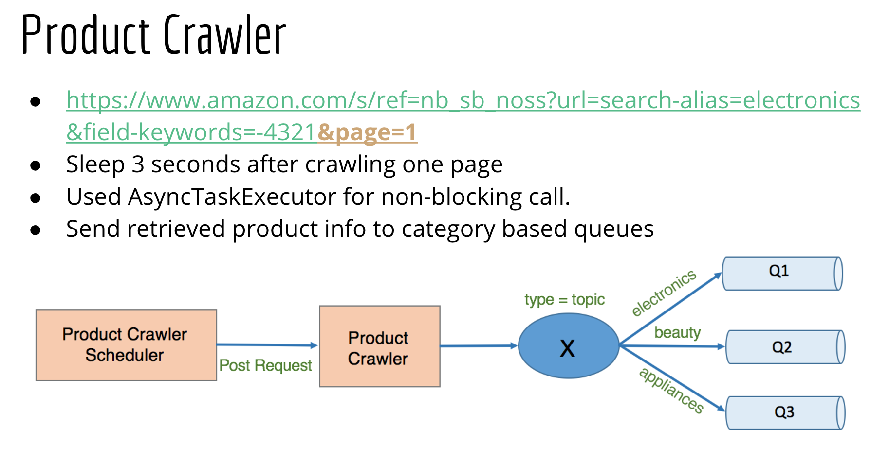
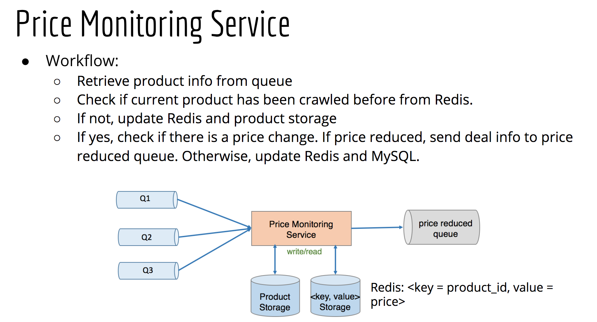

# price-monitoring-system
This system is designed for monitoring price change of Amazon products and sending email notification to subscribers.

**Features:**
- Allow user to subscribe interested product categories via email.
- Keep tracking of price change of Amazon products.
- Send discount information to subscribers via email.
- Allow user to search discount information online.

**To Do:**
- [ ] Implement error logging service.
- [ ] Improve infrastructure services using Spring Cloud.

## Requirements
- Java JDK 8
- Apache Maven
- Rabbitmq
- MySQL
- Redis

## System Design

## Get Started
